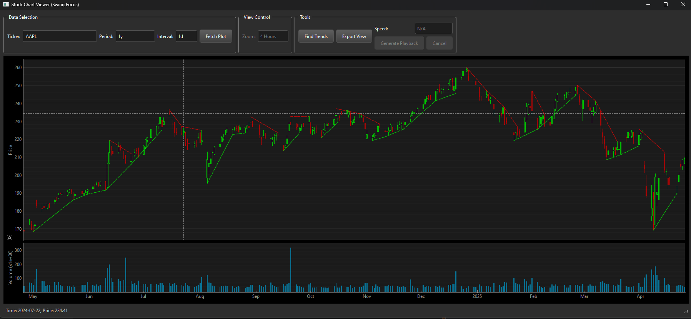

# Chart Pull - Stock Chart Viewer

## Description

This is a Python application built using PyQtGraph that allows users to fetch and visualize historical stock data from Yahoo Finance. The application provides interactive candlestick and volume charts, includes functionality to identify potential trend lines, and offers a playback feature to simulate price movement over time.

## Features

* Fetch historical stock data for any ticker available on Yahoo Finance.
* Visualize data using interactive candlestick and volume charts.
* Display data for various periods (e.g., 1mo, 1y, max) or a custom date.
* Support for different time intervals (e.g., 1m, 1h, 1d).
* Analyze charts to find and display potential uptrend and downtrend lines (requires SciPy).
* Generate a playback (GIF or MP4) of the chart history to see price action unfold.
* Export the current chart view as a PNG image.
* Dark theme for comfortable viewing.

## How to Install and Run

1.  **Clone the repository:**
    ```bash
    git clone [https://github.com/carpsesdema/ChartAnalyzer](https://github.com/carpsesdema/ChartAnalyzer)
    cd Chart_pull
    ```
2.  **Create and activate a virtual environment:**
    * On macOS/Linux:
        ```bash
        python3 -m venv venv
        source venv/bin/activate
        ```
    * On Windows:
        ```bash
        python -m venv venv
        venv\Scripts\activate
        ```
3.  **Install dependencies:**
    ```bash
    pip install -r requirements.txt
    ```
4.  **Run the application:**
    ```bash
    python main.py
    ```

## Dependencies

This project relies on the following libraries, listed in `requirements.txt`:

* `pandas`: For data manipulation.
* `numpy`: For numerical operations.
* `yfinance`: To fetch stock data.
* `PyQt6`: For the graphical user interface.
* `pyqtgraph`: For plotting the charts.
* `pytz`: For timezone handling.
* `scipy`: For trend line analysis (optional, but recommended).
* `tzlocal`: For determining the local timezone.
* `imageio`: For generating playback GIFs/videos.

## How to Use

* Enter a stock ticker symbol in the "Ticker" field.
* Select a data period or a custom date.
* Choose a time interval.
* Click "Fetch Plot" to load and display the data.
* Use the zoom and navigation buttons (for intraday data) to explore the chart.
* Click "Find Trends" to display potential trend lines.
* Click "Export View" to save the current chart view as an image.
* Use the "Generate Playback" tool to create an animated GIF or video of the price history.

## Screenshots

Here are a couple of screenshots demonstrating the application:




*(Remember to adjust the paths `images/candles.png` and `images/trend_candles.png` if you named your image folder something else, and feel free to change the alt text descriptions.)*

## License

This project is licensed under the Apache License 2.0 - see the [LICENSE](LICENSE) file for details.